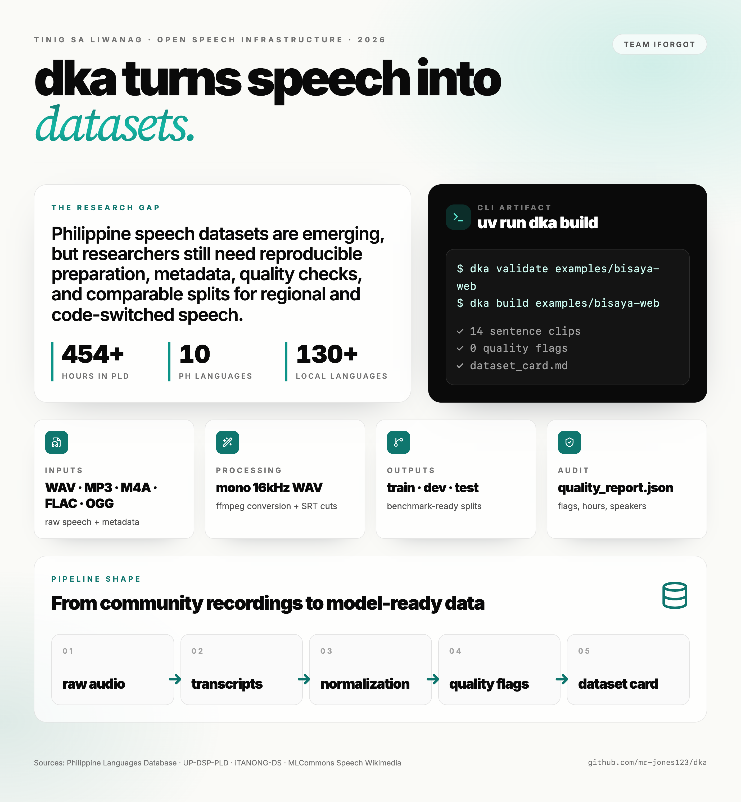

# dka



**Team name:** iForgot  
**Members:** Xynil Jhed Lacap, Lady Diane Casilang, Raphael Andre Mercado

## Chosen track

We chose **GitHub Education Project Case: Tinig sa Liwanag**.

The track asks teams to create reusable, open-source artifacts that advance speech technology for Philippine languages and code-switched speech. Instead of building another app, `dka` focuses on the missing infrastructure layer: preparing raw Philippine-language speech recordings and transcripts into clean, documented, model-ready datasets.

## Problem

The Philippines has more than 130 languages, but speech technology support is still uneven. Regional languages such as Cebuano, Hiligaynon, Ilokano, and Waray remain underrepresented in open ASR and TTS tooling.

Research shows that Philippine speech datasets are emerging, but the ecosystem still needs reusable preprocessing, quality checks, metadata, and benchmark-ready splits:

- The **Philippine Languages Database** paper notes that earlier Filipino speech corpora were often domain-specific, non-parallel, non-multilingual, or insufficient for state-of-the-art ASR/TTS work.
- The **UP-DSP Philippine Languages Database** provides 454+ hours across languages including Filipino, Cebuano, Hiligaynon, Ilokano, Waray, and Tausug, but researchers still need tooling to prepare and audit subsets for experiments.
- The **iTANONG-DS** paper highlights broader Philippine NLP gaps around benchmark datasets, informal language, geographic variation, and code-switching.

## Solution

`dka` is a Python CLI for building Philippine speech datasets.

It turns this:

```text
raw audio + transcript metadata
```

into this:

```text
clean WAV files
normalized metadata
train/dev/test splits
quality reports
dataset card
```

This helps researchers, students, and community contributors prepare Cebuano/Bisaya and other Philippine-language speech data for ASR/TTS experiments without rewriting the same preprocessing scripts.

## What we developed so far

- Python CLI using `uv`
- Rich terminal output
- `dka init` to create a dataset folder
- `dka validate` to check metadata/audio problems
- `dka build` to process datasets
- Audio conversion with `ffmpeg`
  - accepts `.wav`, `.mp3`, `.m4a`, `.flac`, `.ogg`
  - outputs mono 16kHz `.wav`
- `.srt` support
  - cuts long audio into sentence-level WAV clips
  - pairs each clip with subtitle text
- train/dev/test split generation
- quality reports in JSON and Markdown
- generated `dataset_card.md`
- `SKILL.md` so AI agents can use the tool correctly
- example Cebuano/Bisaya datasets from Wikimedia/MLCommons test data

## Install

```bash
uv sync
```

Run locally:

```bash
uv run dka --help
```

## Quick start

```bash
uv run dka validate examples/bisaya-commons
uv run dka build examples/bisaya-commons
```

For `.srt` segmentation:

```bash
uv run dka build examples/bisaya-web
```

Build a small UP-DSP-PLD Cebuano subset and export it for Whisper training:

```bash
uv run dka build data/pld-ceb/PLD/CEB --preset pld --out datasets/pld-ceb-small --limit 500 --hf
```

Train and test Whisper:

```bash
uv run python scripts/train_whisper.py datasets/pld-ceb-small --steps 200
uv run python scripts/inference.py runs/whisper-ceb sample.wav
```

## Input shape

```text
dataset/
  dka.yaml
  raw/
    audio/
      sample_001.wav
    metadata.csv
```

Accepted audio inputs: `.wav`, `.mp3`, `.m4a`, `.flac`, `.ogg` if `ffmpeg` is installed. Outputs are `.wav`.

Minimum `metadata.csv` columns:

```csv
id,audio_path,text,language
sample_001,raw/audio/sample_001.wav,"Maayong buntag",ceb
```

Useful optional columns:

```csv
speaker_id,domain,license,gender,age_group,region,recording_device,source,transcript_path
```

If `transcript_path` points to an `.srt`, `dka build` cuts the long audio into sentence-level WAV files.

## Output shape

```text
dataset/
  processed/
    audio/*.wav
    metadata.csv
  splits/
    train.csv
    dev.csv
    test.csv
  reports/
    quality_report.json
    quality_report.md
  dataset_card.md
```

## Sources

- Philippine Languages Database: https://aclanthology.org/2024.sigul-1.32.pdf
- UP-DSP Philippine Languages Database: https://mozilladatacollective.com/datasets/cmmxhw46c00tqnw07xyr94zjk
- iTANONG-DS benchmark datasets: https://aclanthology.org/2023.icnlsp-1.34.pdf
- MLCommons Speech Wikimedia: https://huggingface.co/datasets/MLCommons/speech-wikimedia
- Wikimedia Commons audio files: https://commons.wikimedia.org/

## Prototype shortcuts

- Audio conversion requires `ffmpeg` on PATH.
- Text normalization is intentionally simple.
- Speaker split falls back to random split if `speaker_id` is missing.
- Example data is for testing/demo only. Verify consent and licenses before publishing a dataset.
